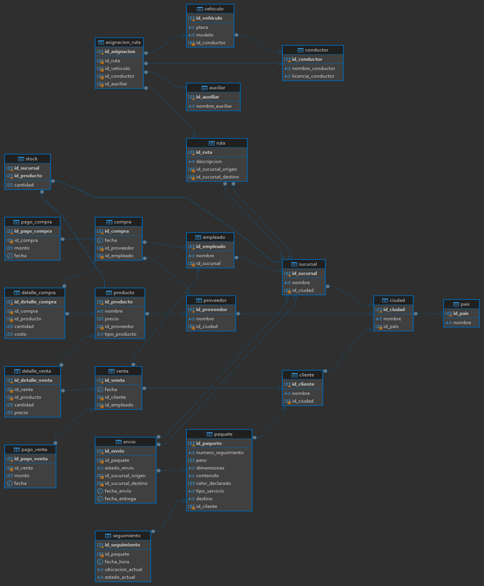

ENTIDADES DE CAMPUSBIKE

Asignación de Ruta 

id_asignacion: int 
id_ruta: int 
id_vehiculo: int 
id_conductor: int 
id_auxiliar: int 
Ruta 

id_ruta: int 
descripcion: varchar(255)
id_sucursal_origen: int 
id_sucursal_destino: int 
Vehículo 

id_vehiculo: int
placa: varchar(10)
modelo: varchar(100)
id_conductor: int 
Conductor 

id_conductor: int 
nombre_conductor: varchar(100)
licencia_conductor: varchar(50)
Auxiliar 

id_auxiliar: int 
nombre_auxiliar: varchar(100)
Ciudad 

id_ciudad: int
nombre: varchar(100)
id_pais: int 
Cliente 

id_cliente: int 
nombre: varchar(100)
id_ciudad: int 
Compra 

id_compra: int 
fecha: date
id_proveedor: int 
id_empleado: int 
Detalle de Compra 

id_detalle_compra: int 
id_compra: int 
id_producto: int 
cantidad: int
costo: decimal(10,2)
Detalle de Venta 

id_detalle_venta: int 
id_venta: int 
id_producto: int 
cantidad: int
precio: decimal(10,2)
Empleado 

id_empleado: int 
nombre: varchar(100)
id_sucursal: int 
Envio 

id_envio: int 
id_paquete: int 
estado_envio: enum('recibido', 'en tránsito', 'entregado', 'retenido en aduana')
id_sucursal_origen: int 
id_sucursal_destino: int 
fecha_envio: date
fecha_entrega: date
Pago Compra 

id_pago_compra: int 
id_compra: int 
monto: decimal(10,2)
fecha: date
Pago Venta 

id_pago_venta: int 
id_venta: int 
monto: decimal(10,2)
fecha: date
País 

id_pais: int 
nombre: varchar(100)
Paquete 

id_paquete: int
numero_seguimiento: varchar(50)
peso: decimal(10,2)
dimensiones: varchar(100)
contenido: text
valor_declarado: decimal(10,2)
tipo_servicio: enum('nacional', 'internacional', 'exprés', 'estándar')
destino: varchar(255)
id_cliente: int 
Producto 

id_producto: int 
nombre: varchar(100)
precio: decimal(10,2)
id_proveedor: int 
tipo_producto: enum('producto', 'repuesto')
Proveedor 

id_proveedor: int 
nombre: varchar(100)
id_ciudad: int 
Sucursal 

id_sucursal: int 
nombre: varchar(100)
id_ciudad: int 
Stock

id_sucursal: int 
id_producto: int 
cantidad: int
Venta (venta)

id_venta: int (PK)
fecha: date
id_cliente: int 
id_empleado: int 
Seguimiento 

id_seguimiento: int 
id_paquete: int 
fecha_hora: datetime
ubicacion_actual: varchar(255)
estado_actual: enum('recibido', 'en tránsito', 'entregado', 'retenido en aduana')

RELACIONES

Asignación de Ruta:

1 a 1 con Ruta
1 a 1 con Vehículo
1 a 1 con Conductor
1 a 1 con Auxiliar
Ruta:

N a 1 con Sucursal (Origen)
N a 1 con Sucursal (Destino)
Vehículo:

N a 1 con Conductor
Cliente:

N a 1 con Ciudad
Compra:

N a 1 con Proveedor
N a 1 con Empleado
Detalle de Compra:

N a 1 con Compra
N a 1 con Producto
Detalle de Venta:

N a 1 con Venta
N a 1 con Producto
Empleado:

N a 1 con Sucursal
Envío:

N a 1 con Paquete
N a 1 con Sucursal (Origen)
N a 1 con Sucursal (Destino)
Pago Compra:

N a 1 con Compra
Pago Venta:

N a 1 con Venta
Paquete:

N a 1 con Cliente
Producto:

N a 1 con Proveedor
Proveedor:

N a 1 con Ciudad
Sucursal:

N a 1 con Ciudad
Stock:

N a 1 con Sucursal
N a 1 con Producto
Venta:

N a 1 con Cliente
N a 1 con Empleado
Seguimiento:

MODELO FISICO

TABLAS
ASIGNACION DE RUTAS
CREATE TABLE `asignacion_ruta` (
  `id_asignacion` int NOT NULL AUTO_INCREMENT,
  `id_ruta` int DEFAULT NULL,
  `id_vehiculo` int DEFAULT NULL,
  `id_conductor` int DEFAULT NULL,
  `id_auxiliar` int DEFAULT NULL,
  PRIMARY KEY (`id_asignacion`),
  KEY `id_ruta` (`id_ruta`),
  KEY `id_vehiculo` (`id_vehiculo`),
  KEY `id_conductor` (`id_conductor`),
  KEY `id_auxiliar` (`id_auxiliar`),
  CONSTRAINT `asignacion_ruta_ibfk_1` FOREIGN KEY (`id_ruta`) REFERENCES `ruta` (`id_ruta`),
  CONSTRAINT `asignacion_ruta_ibfk_2` FOREIGN KEY (`id_vehiculo`) REFERENCES `vehiculo` (`id_vehiculo`),
  CONSTRAINT `asignacion_ruta_ibfk_3` FOREIGN KEY (`id_conductor`) REFERENCES `conductor` (`id_conductor`),
  CONSTRAINT `asignacion_ruta_ibfk_4` FOREIGN KEY (`id_auxiliar`) REFERENCES `auxiliar` (`id_auxiliar`)
)

AUXILIAR
CREATE TABLE `auxiliar` (
  `id_auxiliar` int NOT NULL AUTO_INCREMENT,
  `nombre_auxiliar` varchar(100) NOT NULL,
  PRIMARY KEY (`id_auxiliar`)
)

CIUDAD
CREATE TABLE `ciudad` (
  `id_ciudad` int NOT NULL AUTO_INCREMENT,
  `nombre` varchar(100) NOT NULL,
  `id_pais` int DEFAULT NULL,
  PRIMARY KEY (`id_ciudad`),
  KEY `id_pais` (`id_pais`),
  CONSTRAINT `ciudad_ibfk_1` FOREIGN KEY (`id_pais`) REFERENCES `pais` (`id_pais`)
)
CLIENTES

CREATE TABLE `cliente` (
  `id_cliente` int NOT NULL AUTO_INCREMENT,
  `nombre` varchar(100) NOT NULL,
  `id_ciudad` int DEFAULT NULL,
  PRIMARY KEY (`id_cliente`),
  KEY `id_ciudad` (`id_ciudad`),
  CONSTRAINT `cliente_ibfk_1` FOREIGN KEY (`id_ciudad`) REFERENCES `ciudad` (`id_ciudad`)
)

COMPRA

CREATE TABLE `compra` (
  `id_compra` int NOT NULL AUTO_INCREMENT,
  `fecha` date NOT NULL,
  `id_proveedor` int DEFAULT NULL,
  `id_empleado` int DEFAULT NULL,
  PRIMARY KEY (`id_compra`),
  KEY `id_proveedor` (`id_proveedor`),
  KEY `id_empleado` (`id_empleado`),
  CONSTRAINT `compra_ibfk_1` FOREIGN KEY (`id_proveedor`) REFERENCES `proveedor` (`id_proveedor`),
  CONSTRAINT `compra_ibfk_2` FOREIGN KEY (`id_empleado`) REFERENCES `empleado` (`id_empleado`)
)

CONDUCTOR 

CREATE TABLE `conductor` (
  `id_conductor` int NOT NULL AUTO_INCREMENT,
  `nombre_conductor` varchar(100) NOT NULL,
  `licencia_conductor` varchar(50) NOT NULL,
  PRIMARY KEY (`id_conductor`)
)

DETALLE DE COMPRA

CREATE TABLE `detalle_compra` (
  `id_detalle_compra` int NOT NULL AUTO_INCREMENT,
  `id_compra` int DEFAULT NULL,
  `id_producto` int DEFAULT NULL,
  `cantidad` int NOT NULL,
  `costo` decimal(10,2) NOT NULL,
  PRIMARY KEY (`id_detalle_compra`),
  KEY `id_compra` (`id_compra`),
  KEY `id_producto` (`id_producto`),
  CONSTRAINT `detalle_compra_ibfk_1` FOREIGN KEY (`id_compra`) REFERENCES `compra` (`id_compra`),
  CONSTRAINT `detalle_compra_ibfk_2` FOREIGN KEY (`id_producto`) REFERENCES `producto` (`id_producto`)
)

DEATALLE DE VENTA 

CREATE TABLE `detalle_venta` (
  `id_detalle_venta` int NOT NULL AUTO_INCREMENT,
  `id_venta` int DEFAULT NULL,
  `id_producto` int DEFAULT NULL,
  `cantidad` int NOT NULL,
  `precio` decimal(10,2) NOT NULL,
  PRIMARY KEY (`id_detalle_venta`),
  KEY `id_venta` (`id_venta`),
  KEY `id_producto` (`id_producto`),
  CONSTRAINT `detalle_venta_ibfk_1` FOREIGN KEY (`id_venta`) REFERENCES `venta` (`id_venta`),
  CONSTRAINT `detalle_venta_ibfk_2` FOREIGN KEY (`id_producto`) REFERENCES `producto` (`id_producto`)
)

EMPLEADO
CREATE TABLE `empleado` (
  `id_empleado` int NOT NULL AUTO_INCREMENT,
  `nombre` varchar(100) NOT NULL,
  `id_sucursal` int DEFAULT NULL,
  PRIMARY KEY (`id_empleado`),
  KEY `id_sucursal` (`id_sucursal`),
  CONSTRAINT `empleado_ibfk_1` FOREIGN KEY (`id_sucursal`) REFERENCES `sucursal` (`id_sucursal`)
)

ENVIO 
CREATE TABLE `envio` (
  `id_envio` int NOT NULL AUTO_INCREMENT,
  `id_paquete` int DEFAULT NULL,
  `estado_envio` enum('recibido','en tránsito','entregado','retenido en aduana') NOT NULL,
  `id_sucursal_origen` int DEFAULT NULL,
  `id_sucursal_destino` int DEFAULT NULL,
  `fecha_envio` date DEFAULT NULL,
  `fecha_entrega` date DEFAULT NULL,
  PRIMARY KEY (`id_envio`),
  KEY `id_paquete` (`id_paquete`),
  KEY `id_sucursal_origen` (`id_sucursal_origen`),
  KEY `id_sucursal_destino` (`id_sucursal_destino`),
  CONSTRAINT `envio_ibfk_1` FOREIGN KEY (`id_paquete`) REFERENCES `paquete` (`id_paquete`),
  CONSTRAINT `envio_ibfk_2` FOREIGN KEY (`id_sucursal_origen`) REFERENCES `sucursal` (`id_sucursal`),
  CONSTRAINT `envio_ibfk_3` FOREIGN KEY (`id_sucursal_destino`) REFERENCES `sucursal` (`id_sucursal`)
)

PAGO COMPRA
CREATE TABLE `pago_compra` (
  `id_pago_compra` int NOT NULL AUTO_INCREMENT,
  `id_compra` int DEFAULT NULL,
  `monto` decimal(10,2) NOT NULL,
  `fecha` date NOT NULL,
  PRIMARY KEY (`id_pago_compra`),
  KEY `id_compra` (`id_compra`),
  CONSTRAINT `pago_compra_ibfk_1` FOREIGN KEY (`id_compra`) REFERENCES `compra` (`id_compra`)
)

PAGO VENTA

CREATE TABLE `pago_venta` (
  `id_pago_venta` int NOT NULL AUTO_INCREMENT,
  `id_venta` int DEFAULT NULL,
  `monto` decimal(10,2) NOT NULL,
  `fecha` date NOT NULL,
  PRIMARY KEY (`id_pago_venta`),
  KEY `id_venta` (`id_venta`),
  CONSTRAINT `pago_venta_ibfk_1` FOREIGN KEY (`id_venta`) REFERENCES `venta` (`id_venta`)
)

PAIS
CREATE TABLE `pais` (
  `id_pais` int NOT NULL AUTO_INCREMENT,
  `nombre` varchar(100) NOT NULL,
  PRIMARY KEY (`id_pais`)
)

PAQUETE

CREATE TABLE `paquete` (
  `id_paquete` int NOT NULL AUTO_INCREMENT,
  `numero_seguimiento` varchar(50) NOT NULL,
  `peso` decimal(10,2) NOT NULL,
  `dimensiones` varchar(100) DEFAULT NULL,
  `contenido` text,
  `valor_declarado` decimal(10,2) DEFAULT NULL,
  `tipo_servicio` enum('nacional','internacional','exprés','estándar') NOT NULL,
  `destino` varchar(255) NOT NULL,
  `id_cliente` int DEFAULT NULL,
  PRIMARY KEY (`id_paquete`),
  KEY `id_cliente` (`id_cliente`),
  CONSTRAINT `paquete_ibfk_1` FOREIGN KEY (`id_cliente`) REFERENCES `cliente` (`id_cliente`)
)

PRODUCTO
CREATE TABLE `producto` (
  `id_producto` int NOT NULL AUTO_INCREMENT,
  `nombre` varchar(100) NOT NULL,
  `precio` decimal(10,2) NOT NULL,
  `id_proveedor` int DEFAULT NULL,
  `tipo_producto` enum('producto','repuesto') DEFAULT 'producto',
  PRIMARY KEY (`id_producto`),
  KEY `id_proveedor` (`id_proveedor`),
  CONSTRAINT `producto_ibfk_1` FOREIGN KEY (`id_proveedor`) REFERENCES `proveedor` (`id_proveedor`)
)

PROVEEDOR

CREATE TABLE `proveedor` (
  `id_proveedor` int NOT NULL AUTO_INCREMENT,
  `nombre` varchar(100) NOT NULL,
  `id_ciudad` int DEFAULT NULL,
  PRIMARY KEY (`id_proveedor`),
  KEY `id_ciudad` (`id_ciudad`),
  CONSTRAINT `proveedor_ibfk_1` FOREIGN KEY (`id_ciudad`) REFERENCES `ciudad` (`id_ciudad`)
) 

RUTA 
CREATE TABLE `ruta` (
  `id_ruta` int NOT NULL AUTO_INCREMENT,
  `descripcion` varchar(255) NOT NULL,
  `id_sucursal_origen` int DEFAULT NULL,
  `id_sucursal_destino` int DEFAULT NULL,
  PRIMARY KEY (`id_ruta`),
  KEY `id_sucursal_origen` (`id_sucursal_origen`),
  KEY `id_sucursal_destino` (`id_sucursal_destino`),
  CONSTRAINT `ruta_ibfk_1` FOREIGN KEY (`id_sucursal_origen`) REFERENCES `sucursal` (`id_sucursal`),
  CONSTRAINT `ruta_ibfk_2` FOREIGN KEY (`id_sucursal_destino`) REFERENCES `sucursal` (`id_sucursal`)
)

SEGUIMIENTO
CREATE TABLE `seguimiento` (
  `id_seguimiento` int NOT NULL AUTO_INCREMENT,
  `id_paquete` int DEFAULT NULL,
  `fecha_hora` datetime NOT NULL,
  `ubicacion_actual` varchar(255) DEFAULT NULL,
  `estado_actual` enum('recibido','en tránsito','entregado','retenido en aduana') NOT NULL,
  PRIMARY KEY (`id_seguimiento`),
  KEY `id_paquete` (`id_paquete`),
  CONSTRAINT `seguimiento_ibfk_1` FOREIGN KEY (`id_paquete`) REFERENCES `paquete` (`id_paquete`)
)

SCTOK
CREATE TABLE `stock` (
  `id_sucursal` int NOT NULL,
  `id_producto` int NOT NULL,
  `cantidad` int NOT NULL,
  PRIMARY KEY (`id_sucursal`,`id_producto`),
  KEY `id_producto` (`id_producto`),
  CONSTRAINT `stock_ibfk_1` FOREIGN KEY (`id_sucursal`) REFERENCES `sucursal` (`id_sucursal`),
  CONSTRAINT `stock_ibfk_2` FOREIGN KEY (`id_producto`) REFERENCES `producto` (`id_producto`)
)
SUCURSAL
CREATE TABLE `sucursal` (
  `id_sucursal` int NOT NULL AUTO_INCREMENT,
  `nombre` varchar(100) NOT NULL,
  `id_ciudad` int DEFAULT NULL,
  PRIMARY KEY (`id_sucursal`),
  KEY `id_ciudad` (`id_ciudad`),
  CONSTRAINT `sucursal_ibfk_1` FOREIGN KEY (`id_ciudad`) REFERENCES `ciudad` (`id_ciudad`)
) 

VEHICULO 
CREATE TABLE `vehiculo` (
  `id_vehiculo` int NOT NULL AUTO_INCREMENT,
  `placa` varchar(10) NOT NULL,
  `modelo` varchar(100) DEFAULT NULL,
  `id_conductor` int DEFAULT NULL,
  PRIMARY KEY (`id_vehiculo`),
  KEY `id_conductor` (`id_conductor`),
  CONSTRAINT `vehiculo_ibfk_1` FOREIGN KEY (`id_conductor`) REFERENCES `conductor` (`id_conductor`)
)

VENTA 

CREATE TABLE `venta` (
  `id_venta` int NOT NULL AUTO_INCREMENT,
  `fecha` date NOT NULL,
  `id_cliente` int DEFAULT NULL,
  `id_empleado` int DEFAULT NULL,
  PRIMARY KEY (`id_venta`),
  KEY `id_cliente` (`id_cliente`),
  KEY `id_empleado` (`id_empleado`),
  CONSTRAINT `venta_ibfk_1` FOREIGN KEY (`id_cliente`) REFERENCES `cliente` (`id_cliente`),
  CONSTRAINT `venta_ibfk_2` FOREIGN KEY (`id_empleado`) REFERENCES `empleado` (`id_empleado`)
)

N a 1 con Paquete

