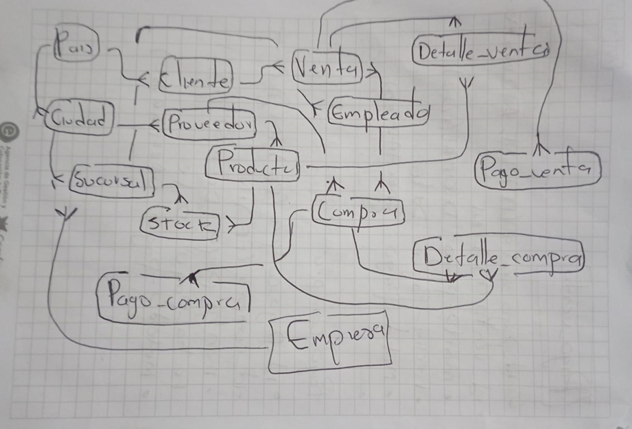

ENTIDADES DE CAMPUSBIKE

Asignación de Ruta 

id_asignacion: int 
id_ruta: int 
id_vehiculo: int 
id_conductor: int 
id_auxiliar: int 
Ruta 

id_ruta: int 
descripcion: varchar(255)
id_sucursal_origen: int 
id_sucursal_destino: int 
Vehículo 

id_vehiculo: int
placa: varchar(10)
modelo: varchar(100)
id_conductor: int 
Conductor 

id_conductor: int 
nombre_conductor: varchar(100)
licencia_conductor: varchar(50)
Auxiliar 

id_auxiliar: int 
nombre_auxiliar: varchar(100)
Ciudad 

id_ciudad: int
nombre: varchar(100)
id_pais: int 
Cliente 

id_cliente: int 
nombre: varchar(100)
id_ciudad: int 
Compra 

id_compra: int 
fecha: date
id_proveedor: int 
id_empleado: int 
Detalle de Compra 

id_detalle_compra: int 
id_compra: int 
id_producto: int 
cantidad: int
costo: decimal(10,2)
Detalle de Venta 

id_detalle_venta: int 
id_venta: int 
id_producto: int 
cantidad: int
precio: decimal(10,2)
Empleado 

id_empleado: int 
nombre: varchar(100)
id_sucursal: int 
Envio 

id_envio: int 
id_paquete: int 
estado_envio: enum('recibido', 'en tránsito', 'entregado', 'retenido en aduana')
id_sucursal_origen: int 
id_sucursal_destino: int 
fecha_envio: date
fecha_entrega: date
Pago Compra 

id_pago_compra: int 
id_compra: int 
monto: decimal(10,2)
fecha: date
Pago Venta 

id_pago_venta: int 
id_venta: int 
monto: decimal(10,2)
fecha: date
País 

id_pais: int 
nombre: varchar(100)
Paquete 

id_paquete: int
numero_seguimiento: varchar(50)
peso: decimal(10,2)
dimensiones: varchar(100)
contenido: text
valor_declarado: decimal(10,2)
tipo_servicio: enum('nacional', 'internacional', 'exprés', 'estándar')
destino: varchar(255)
id_cliente: int 
Producto 

id_producto: int 
nombre: varchar(100)
precio: decimal(10,2)
id_proveedor: int 
tipo_producto: enum('producto', 'repuesto')
Proveedor 

id_proveedor: int 
nombre: varchar(100)
id_ciudad: int 
Sucursal 

id_sucursal: int 
nombre: varchar(100)
id_ciudad: int 
Stock

id_sucursal: int 
id_producto: int 
cantidad: int
Venta (venta)

id_venta: int (PK)
fecha: date
id_cliente: int 
id_empleado: int 
Seguimiento 

id_seguimiento: int 
id_paquete: int 
fecha_hora: datetime
ubicacion_actual: varchar(255)
estado_actual: enum('recibido', 'en tránsito', 'entregado', 'retenido en aduana')

RELACIONES

Asignación de Ruta:

1 a 1 con Ruta
1 a 1 con Vehículo
1 a 1 con Conductor
1 a 1 con Auxiliar
Ruta:

N a 1 con Sucursal (Origen)
N a 1 con Sucursal (Destino)
Vehículo:

N a 1 con Conductor
Cliente:

N a 1 con Ciudad
Compra:

N a 1 con Proveedor
N a 1 con Empleado
Detalle de Compra:

N a 1 con Compra
N a 1 con Producto
Detalle de Venta:

N a 1 con Venta
N a 1 con Producto
Empleado:

N a 1 con Sucursal
Envío:

N a 1 con Paquete
N a 1 con Sucursal (Origen)
N a 1 con Sucursal (Destino)
Pago Compra:

N a 1 con Compra
Pago Venta:

N a 1 con Venta
Paquete:

N a 1 con Cliente
Producto:

N a 1 con Proveedor
Proveedor:

N a 1 con Ciudad
Sucursal:

N a 1 con Ciudad
Stock:

N a 1 con Sucursal
N a 1 con Producto
Venta:

N a 1 con Cliente
N a 1 con Empleado
Seguimiento:

N a 1 con Paquete

